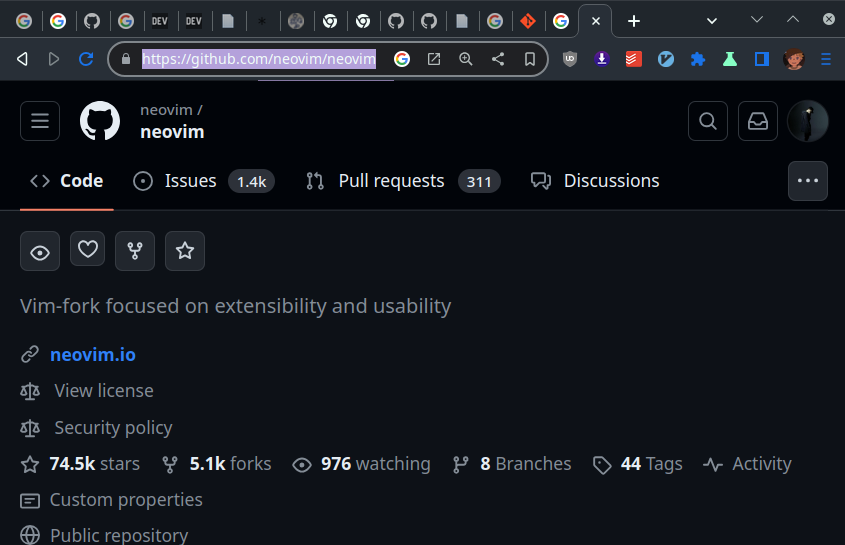

# Git

## prerequisites
- [Linux](./Linux.md)

## Kick start
- [adding a local repo to git](#adding-a-local-repo-to-git)
## Topics

- [Introduction](#introduction)
- [Installation](#installation)
- [Initial Setup](#initial%20setup)
- [Basics](#basics)
    - [Getting a Git Repository]()
        - [Creating a repo]()
        - [Cloning a repo]()
    - [Submitting that change]()

- [References]()

## Kick start 

#### Adding a local repo to git

```bash
echo "# Chad tmux" >> README.md
git init
git add README.md
git commit -m "first commit"
git branch -M main
git remote add origin https://github.com/aruncs31s/chad_tmux
git push -u origin main
```


## Topics

### **Introduction**


  Git is a `source control` created for the `Linux` Kernel by `Linus Torvalds`.
<details>
<summary>More</summary>
    Git works the familiar primitives of source control management systems such as `commits`, `diffs`,`trunks`, `tags`, branches, and so on. However, Git has the intrinsic property of being a distributed system - a system in which there is no official client/server relationship. Each repository contains the entire history of revisions. This means that there's no need to have network access or synchronization to a central repository. In essence, a git repository is nonlinear with regard to revisions. two different users may change source code in unique, independent ways without interfering with each other. one benefit of this model is that developers are freer to independently work with, experiment with, and tweak code.
	Git supports independent development and revision management, it also supports the means to share and incorporate revisions made in unsynchronized repositories.
</details>

###### summary
- Git is a VCS(version control system)
<details><summary>VCS</summary>
</details>

- Git stores data as snapshots and if file is not changed


---

### **Installation**

<details><summary> <b>Notes :</b> </summary>

Install [`gh`](https://cli.github.com/) which is a cli version of github and it is easier this was to to login to your github account through `git`

</details>


- Windows [Click Here](https://git-scm.com/download/win)
- Debian
```bash
sudo apt install git
```

- Fedora
```bash
sudo dnf install git
```

- Arch Linux 
```
sudo pacman -S git
```
---

### **Initial Setup**
This only required to do once like configuring user email and user name 
- Setting up you identity

```
git config --global user.name "You name"
git config --global user.email youremail@google.com
```
*You can exclude `--global` flag it sets this properties as global but if you want to keep repository wise configs you simply exclude that*


- You can use the following to see saved configs
```bash
git config --list 
```

- Setting up default editor
```bash
git config --global core.editor nano 
```
*You can use nano , vim, emacs,any editor you want*

- Your Difault branch name

```bash
git config --global init.defaultBranch main
```


---


### **Basics**
- [Getting a Git Repository](#getting-a-git-repository)
    - [Adding a local folder to git]()
    - [Cloning a repo]()


#### **Getting a Git Repository**
There are mainly 2 ways to get a git repo, and by git repo i mean a directory(repocitory) managed by git version control. The two ways of getting git repo is as follows
1. [Adding a local folder to git](#adding-a-local-folder-to-git)
2. [Cloning an existing repo](#cloning-an-existing-repo)


##### Adding a local folder to git

```bash
echo "# tic_tac_toe" >> README.md
git init
git add README.md
git commit -m "first commit"
git branch -M main
git remote add origin https://github.com/BloBuster/tic_tac_toe.git
git push -u origin main
```
- Here we used `echo` to write `# tic_tac_toe` to `README.md` 
- and `git init` to initialize the repo
- used `git add README.md` to stage the change for commit
- Used `git commit -m "first commit"` to write commit message
<details><summary>Example commit message</summary>


*You can see that right after `LICENSE` there is a description kinda thing saying `"Initial commit"`*

</details>


<details><summary>Examples</summary>


</details>

<details><summary>Use case</summary>

Imagine you're never used git and you have this amazing project that you want to share with others like a game written in `python` and you can simply add this to git and upload it to github

###### Steps to add that repo(project folder) to github 
*For this example we'll use `car_racing` as directory name and `racing.py` as the file containing that game*
1. `cd` to that directory


2. Use `git init` to initialize that directory with git


```bash
git init
```


<details><summary>Explanation</summary>

You can see that fist when i type ls -al there is only `.` and `racing.py` but after when i type `git init` and then do `ls -al` we can see that suddenly a new folder called `.git` comes up. The `.git` folder contains all the metadata and files need to manage the directory/rep/project etc..


</details>


*Note* : *You can uninitialize a repo by simply removing the `.git` folder and reinitialize by `git init`

3. Add a `README.md` 
This step is optional and `README.md` is mainly used to give the documentation about your project and if you don't care about documentation then you can simply skip this step and move on
```bash
echo "Some text >> README.md"
git add README.md
```
*Note* : *I Have simply used echo to insert text into that `README.md` file you can use your favourate text editor*

4. Add your game racing.py
|
```bash
git add racing.py
```

</details>


5. Commit the new change
```bash
git commit -m "You messege" 
```
*Note* : *You can just type `git commit` and it will popup a file `COMMIT_EDITMSG` in your `core.editor`
<details><summary>Example</summary>


*You can see that i've used `git add` to add the edited file `Git.md`*

*and I've used `git commit` to set the commit message* 
</details>

<br>

##### Cloning an existing repo


```bash
git clone <repo_link>

```


- replace `repo_link` with desired repo link
<details><summary>Examples</summary>




```bash
git clone https://github.com/neovim/neovim

```
</details>

*Note* : *If you use `git clone` it will clones  the entire history of the repository and to avoid that include `--depth <depth_of_commit>` to download history upto `depth_of_commit`* 
<details><summary>Example</summary>

```bash
git clone https://github.com/neovim neovim --depth 1    
```
*This will only take less amount of space and time to clone*
</details>


#### Submitting that change
After you editing you need to submit that changes.


