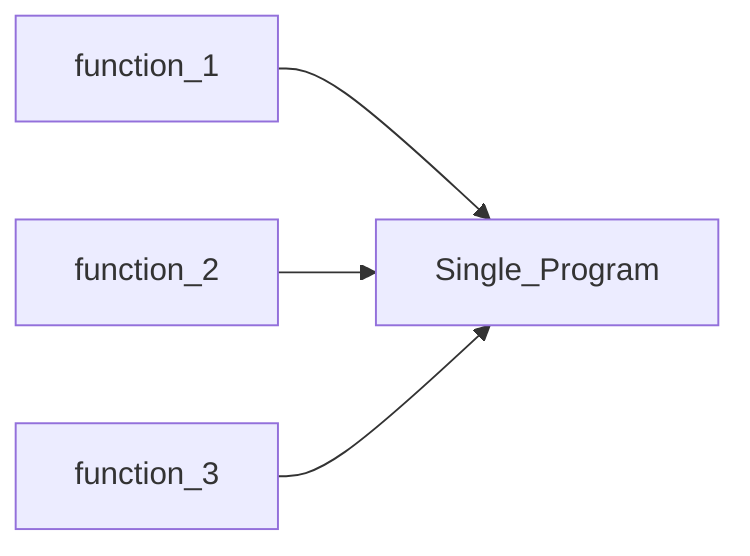

# Intermediate

In this section you will learn about this is not in some particular order 

1. Functions
2. Scope 
3. Precedence
4. OOP
5. Classes 
6. Objects 
7. 
**rule** 🔨 -> {**def(what)**,**why**,**when**,**example**}

| x               | explenation of x |
| --------------- | ---------------- |
| **Def**         | Defenition       |
| #example        | example          |
| syntactic sugar | make it readable |


 >[!important]
 >You should know [[Basics|this]] before doing this. 


## 1. Functions 
**Def:** According to [this](https://www.geeksforgeeks.org/c-functions/) article  -> A function in C is a set of statements that, when called, perform some specific tasks 

```cpp
return_type function_name(arguments){
	// block of code..
	return <value>;
}
```

- the `return_type` can be -> `int,float etc` or custom data type made using **structs** 


**why:** As  far as i know you can write an entire application which does not have functions(i meant user defined functions) except `main()` , this is ok for simple programs that we do first while learning , but as we get hands on the real world problems , functions are must , otherwise you will end up with a file that is few mega bites in size. Using only a single function is not impossible but the main use of functions is to **reduce code** and **reuse code**.   




**when:** For example lets consider a psudo[^1] finding roots of a quadratic equation.
we know the equation 
$$
x = \frac{-b \pm \sqrt{b^2 - 4ac}}{2 a }
$$

This code is written without functions , for the time being ignore the `main()` function 
```cpp
float a , b , c ; // for storing coeefficients
a = 1 ; b = 2 ; c = -3 ;
float x1 , x2  ; // storing the result
x1 = -b + sqrt(b*b - 4*a*c) / 2 * a ;
x2 = -b - sqrt(b*b - 4*a*c) / 2 * a;
```

This is written with functions 

```cpp 
void get_roots(float a , float b , float c , float &x1,float &x2){
	x1 = -b + sqrt(b*b - 4*a*c) / 2 * a;
	x2 = -b - sqrt(b*b - 4*a*c) / 2 * a;
}
float x1, x2 ; 
get_roots(1,2,-3,x1,x2);
```
You can see that that the program is gotten bigger. But if we try to compute roots of 5 quadratic equations the first program will become 


```cpp
float a , b , c ; // for storing coeefficients
a = 1 ; b = 2 ; c = -3 ;
float x1 , x2  ; // storing the result
x1 = -b + sqrt(b*b - 4*a*c) / 2 * a ;
x2 = -b - sqrt(b*b - 4*a*c) / 2 * a;
a = 1 ; b = 3 , c = 4 
x1 = -b + sqrt(b*b - 4*a*c) / 2 * a ;
x2 = -b - sqrt(b*b - 4*a*c) / 2 * a;
a = 1 ; b = 3 , c = 4 
x1 = -b + sqrt(b*b - 4*a*c) / 2 * a ;
x2 = -b - sqrt(b*b - 4*a*c) / 2 * a;
a = 1 ; b = 3 , c = 4 
x1 = -b + sqrt(b*b - 4*a*c) / 2 * a ;
x2 = -b - sqrt(b*b - 4*a*c) / 2 * a;
a = 1 ; b = 3 , c = 4 
x1 = -b + sqrt(b*b - 4*a*c) / 2 * a ;
x2 = -b - sqrt(b*b - 4*a*c) / 2 * a;
```
Now the program with function will become 

```cpp
void get_roots(float a , float b , float c , float &x1,float &x2){
x1 = -b + sqrt(b*b - 4*a*c) / 2 * a;
x2 = -b - sqrt(b*b - 4*a*c) / 2 * a;
}
float x1, x2 ; 
get_roots(1,2,-3,x1,x2);
get_roots(1,2,-3,x1,x2);
get_roots(1,2,-3,x1,x2);
get_roots(1,2,-3,x1,x2);
get_roots(1,2,-3,x1,x2);
```
One can say that in the non function program , i'm just assigning arbitrary values to `a,b` and `c` then calculating using `x2 = -b - sqrt(b*b - 4*a*c) / 2 * a;`


[^1]: #todo Find the exact word 
###  Declaration or function prototyping 
```cpp
type functionName(argument_lists);
```
type is essentially means the **return type** of the function. 

#examples 

```cpp
int sum(int a , int b);
int sum(int,int);
```


### Return type 
Consider this following program 
```cpp
#include <iostream>
int sum(int number_1,int number_2){
    return number_1 + number_2; 
}
int main(){
    int a = 10 , b = 5 ;
    int c = sum(a,b);
    std::cout << "a + b = " <<  c << std::endl;
}
```

```output
a + b = 15
```
There is a function named `sum` which has a **return type** of `int` , the return type is chose according to what type of data we are expecting from the function. For simplicity  lets consider the following program which is similar to the above program 
```cpp
#include <iostream>
int sum(int number_1,int number_2){
    return number_1 + number_2; 
}
int main(){
    int a = 10.1, b = 5.4 ;
    int c = sum(a,b);
    std::cout << "a + b = " <<  c << std::endl;
}
```
the main change is that `a` is now 10.1 and `b` is now 5.4 
**output**
```output 
a + b = 15
```
But we can not see any difference in the **output** it is still $15$ also we get warnings like `implicit conversion from double to int` 

![[Screenshot 2025-05-13 at 6.54.57 PM.png]]
ie 
- 10.1(double) is converted to 10(integer)
- 5.4(double) is converted to 5(integer)

```cpp
#include <iostream>
float sum(float number_1,float number_2){
    return number_1 + number_2; 
}
int main(){
    float a = 10.1, b = 5.4 ;
    float c = sum(a,b);
    std::cout << "a + b = " <<  c << std::endl;
}
```

```output
a + b = 15.5
```


**Can we achieve this using only int?** YES

```cpp
#include <iostream>
typedef struct result{
    int integer_part;
    int decimal_part;
}result;
result sum(int number_1, int number_2,int number_3, int number_4){
    result r;
    r.integer_part = number_1 + number_2;
    r.decimal_part = number_3 + number_4;
    return r;
}
int main(){
    int a = 10, b = 5 , c = 1, d = 4; // 0.1 -> 1 , .4 -> 4 
    result res = sum(a, b, c, d);
    std::cout << "a + b = " << res.integer_part + (res.decimal_part/10.0) << std::endl;
    return 0;
}
```
```output
a + b = 15.5
```
we can see that there are already extra complexity , and if the number is `0.01` instead of `0.1` this program will fail. but we can overcome that using a while or for loop by simply checking the length of the **integer**


>[!Summary] choosing datatypes
>Data type is must be chose carefully , most of the round off errors will happen due to incorrect datatypes and data types can also influence the performance of the program 

### Custom Data types in Functions 

```cpp
#include <iostream>
using namespace std;
struct Point {
    int x;
    int y;
};
struct Point create_point(int x, int y) {
    struct Point p;
    p.x = x;
    p.y = y;
    return p;
}
int main() {
    struct Point p = create_point(3, 4);
    cout  << p.x << ", " << p.y << endl;
}
```

#syntactic_sugar

```cpp
#include <iostream>
using namespace std;
typedef struct Point {
    int x;
    int y;
} Point;
Point create_point(int x, int y) {
    Point p;
    p.x = x;
    p.y = y;
    return p;
}
int main() {
    Point p = create_point(3, 4);
    cout  << p.x << ", " << p.y << endl;
}
```


## 2. Scope 
**Def:** *Scope of a variable the region of code within which a variable is accessible*[^1]. 
- the scope of a variable is constrained inside `{}`  
[^1]: https://docs.julialang.org/en/v1/manual/variables-and-scoping
```cpp
#include <iostream>
int a = 10;
void funtion(){
    std::cout << "from function a = " << a << std::endl;
}
int main(){
    std::cout << "global a = " << a << std::endl;
    
    int a = 5;
    funtion();
    std::cout << "local a = " << a << std::endl;

    std::cout << "global a = " << ::a << std::endl;
}
```

```output
global a = 10
from function a = 10
local a = 5
global a = 10
```

**Why:** the scope thing allows us to use/reuse names for local access , for example almost every programmer uses **i** then **j** for loops or as the **iterator** , scope is the best way to avoid pollution , if there no scopes we have to find new names for each variable that is going to be declared . 


## Control Statements 
- if-else
- while 
- do-while
- for
- switch

### if-else
#syntax
```cpp
if (expression)
	statement
```
```cpp
if (expression)
	statement
else
	statement
```

```cpp
if (expression)
	statement
else if (expression)
	statement 
else
	statement 
```
- we can also chain if-else 
```cpp
if (expression)
	if(expression)
		if(expression)
			statement
```
which is similar to 
```cpp
if(expression && expression && expression)
	statement
```

#examples 
```cpp
#include <iostream>
int main(){
int a = 10 ;
if (a == 10 ){
	std::cout << "HI" << std::endl;
	}
}
```

```op
HI
```


```cpp
#include <iostream>
int main(){
int a = 10 ;
if (a == 9 ){
	std::cout << "HI" << std::endl;
	}
}
```
```output
// Nothing will be here 
```

>[!note] true and flase 
>a value other than 1 is consderd as true , so the following programs all will output the same result 
>
```cpp
> #include <iostream>
int main(){
int a = 10 ;
if (a - 5 ){ // true
 	std::cout << "HI" << std::endl;
 	}
 }
```

 ```cpp
 #include <iostream>
 int main(){
 int a = 10 ;
 if (a - 100){ // true 
  	std::cout << "HI" << std::endl;
 	}
 }
 ```


### While

```cpp
while(expression)
	statement
```

- [ ] Complete loops 


## C++ Structs
You all will be familiar with C structs if dont check this [[Basics|Structs]]. 
Look at one #example
```cpp
#include <iostream>
using namespace std;
struct Point{
    int x;
    int y;
    Point(int _x, int _y) : x(_x), y(_y) {}
    void display() {
        cout << "Point(" << x << ", " << y << ")" << endl;
    }
};
int main(){
    Point p1(10, 20);
    p1.display();
}
```
First thing you can notice is that , in struct definition there are member functions , Constructor etc.

**Constructor**
```cpp
Point(int _x, int _y) : x(_x), y(_y) {}
```
This will assign value `_x` to `x` and value `_y` to `y`  . You can extend this to make things like the following.

```cpp
Point(int _x, int _y) {
        x = _x * 100;
        y = _y * 100;
    }
```
This is exactly like the C++ Class constructor.


**Member Functions**

```cpp
void display() {
        cout << "Point(" << x << ", " << y << ")" << endl;
    }
```

you can call them by `struct_name.function_name()` just like accessing the value inside a struct 


## C++ Class 