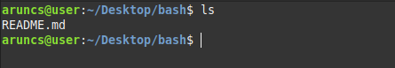
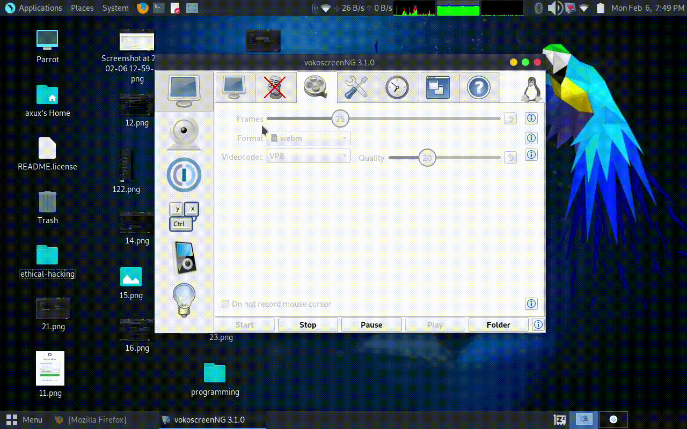

## **Pre-Requests**

Inorder to Upload it `documentations` and `stuff` to Github you need to know the following things
- [Linux](#linux)
  - [linux for Hackers](#linux-for-hackers)
  - [Installition](#installition)
  - 

- [Git](#git)
    - [Introduction](#git-introduction)
    - [Installition](#git-installition)
    - [Working with Repos](#working-with-repositories)
    - 
- [Github](#github)

- [Github-Readme.md](#github-readme)
- [Github-Fork](#github-fork)

### **Linux**
  Linux is a free and open source operating system that uses linux kernal and mainained by FOSS developers. Linux is easy and the same difficult to understand if you don't have enough technical knowledge, it is also to be noted that you will never learn linux unless u actually use it . It is just like windows and macos but it is free and open source so you dont have to pay anything to get it working on your machine . It can be installed on a hardware as small as your home router in fact linux is the lites among all other os's . 
#### **Linux for Hackers**
  Most of the time(aproximately all the time) a hacker will use Linux for their hacking purpose Hacking os to be exact . A Hacking os comes with pre installed tools for hacking and other usefull tools which helps them to make hacking ease . Some examples of such os are `Kali linux`([click here](https://www.kali.org/docs/) to know more) by offensive security , `Parrot os`( [Click here](https://www.parrotsec.org/) to know more) by [Some good developers](https://www.parrotsec.org/team/) and `Balck arch`

#####  **Parrot os** 
  <!-- source wikkipedia https://en.wikipedia.org/-->
  Parrot os is a debian based linux distro specially for hackers and security specialists and can be also used for normal computing tasks like watching movies surfing the internet the good stuffs . Intrestingly enough they have the like special purpose versions for `Penetration Testing and Red Team operations` that is the ` Security edition` and <!-- by parrotsec --> `Home edition` for normal use so on 


#### **Installition**
  It is pretty easy to install linux on older hardware compared to newer once and there are plety of installers out there which comes with automated scripts to install linux and if you are very intrested in hard working you can also try to install a linux distro called `Arch linux` which is difficult to install but offers more control over what your installing
  &#160;&#160;&#160;&#160;&#160;When its comes to installing linux you have to chose from overweling amount of distros which is the most complicated decition among these installing steps for example there is `Ubuntu` , `Manjaro` , `Mint` , `MX linux` the list will go on and on an  on, i will recomment `Linux Mint` or `Ubuntu` if your new to Linux but we are intrested in Hacking So we will choose either `kali linux` , `Paroot os` or `Black arch` 


#### Linux File System

 

**/bin :**  


<details>
<summary>Notes: </summary>You can get full usage of almost any command in linux usig --help option with_ _sometimes -h also works and do the same_
eg:

```
$ pwd --help
```

output

```
pwd: pwd [-LP]
    Print the name of the current working directory.                                                                                                            Options:
      -L        print the value of $PWD if it names the current working directory
      -P        print the physical directory, without any symbolic links

    By default, `pwd' behaves as if `-L' were specified.
                                                                                  Exit Status:
    Returns 0 unless an invalid option is given or the current directory
    cannot be read
```
</details>


--- 
## Basic commands

| Commands |  Description           |
| :--------: | ------------------------ |
|[`mkdir`](#mkdir)| To make a directories/directory(folder)|
| [`ls`](#ls)     | List all the files in the current directry      |
| [`pwd`](#pwd)  | Print the name of the current working directory |
| [`cd`](#cd)     | change the current working directry             |
| [`mv`](#mv)| move files to directories or rename files|
|[`cp`](#cp)|copy files to directories |
| [`rm`](#rm)| To remove files/directories | 

## ***more about this below***

### ***mkdir***
  *[`mkdir`](#mkdir) (make directory)*  is used to create directory(folder) or miltiple directories (folders)

*we can create a folder called new-directory using mkdie*

```
$ mkdir new-folder

```


[`mkdir`](#mkdir)o list out folders and files the current working directory


*we can also create multiple directories using [`mkdir`](#mkdir)* 


*we can see that if we type more names after  [`mkdir`](#mkdir) it creates mutliple [`directory`](../Dictionary#directory)*

*So the basic syntax of mkdir is*

```
$ mkdir <foldername> <foldername2> ...

```
learn more about `mkdir`     [here](https://www.gnu.org/software/coreutils/mkdir)


### ***ls***

_Normaly bash program will be situated under the /bin folder where almost all the user executable programs contains you can take a look at what inside that folder by_

```
$ ls /bin
```

_so we used `ls` to list all the files_




<details>
<summary>Notes: </summary>
*we can give some arguments to the ls command which will produce diffrent outputs*
*for example "-lh" argument combined with `ls` will show you the size of that file*
</details>


> -l is used to use a long listing format

> -h is used to make it human readable 

*Learn more about  `ls`  [here](https://www.gnu.org/software/coreutils/ls) 

### ***pwd***
  *`pwd` is used to know your [current directory](../Dictionar#current-directory)*


*The /home/aruncs folder have an nother property it is yout home path* [more about this](#paths)


### ***cd***
  `cd` is used for changing working [`directries`](../Dictionary/README.md/#directory)(folder)


<details>
<summary>Notes</summary>
*To understand this simply consider if we have to delete a file which we have downloaded from internet and we dont know it's name but it is in the folder `$HOME/Downloads` we can do this in many ways azbut one of the easyest way is to go into the folder and inspect the files and delete the one that we dont need suppose we want to delete song.mp3 form download ; we first need to go to the folder specified above so inorder to go to that folder we use `cd`(change directory) command*
</details>

#### **Usage**

``` 
cd /path/to/the/folder

```


we can see there is a folder named test in our current working directry


Tip: We used [`ls`](#ls) command to list(to see as a list) the files


*Dont confuse with that path name, we will cover that one in
linux file system* 

*So specified the path name after cd , after that we can see that our current directory is changed to `/tmp/test/test` before it was `/tmp/test`

### **cp**

**cp** is used to copy files/folders  


#### **Usage**
```
cp old_name new_name 
```
which renames file named name1 to name2 

**Note:** We can use cp to copy folders as well as files 

<details><summary>Explenation: </summary>

</details>

```
$ ls

song.mp3

$ cp song.mp3 old_song.mp3 

$ ls

old_song.mp3
```

</details>


---
### **mv**
**mv** is mainly used to move or renames files the 

#### **Uses**

```
mv old_name new_name

```


##### **Files**
```
mv old_name new_name
```

**Note:** We can use `mv` to rename both folders and files


<details><summary>Explenation: </summary>

f
</details>

---
### **rm**
    `rm` is used to remove files or folders, 

#### **Usage**

```
rm file_name

rm folder_name


```
<details><summary>Note: </summary>Inorder to remove folders/directories you need to use `--recursive` `-r` and you can also force the deletion using `-f` `--force` argument</details>

[more details](https://gnu.org/software/coreutils/rm)

```
$ ls

song.mp3

$ rm song.mp3

$ ls

$
```


## **Paths**

*We can check the current Varriables that are beeing used by just typing system

```
$ set
BASH=/usr/bin/bash
BASHOPTS=checkwinsize:cmdhist:complete_fullquote:expand_aliases:extglob:extquote:force_fignore:globasciiranges:histappend:interactive_comments:progcomp:promptvars:sourcepath
BASH_ALIASES=()
BASH_ARGC=([0]="0")
BASH_ARGV=()
BASH_CMDS=()
BASH_COMPLETION_VERSINFO=([0]="2" [1]="11")
BASH_LINENO=()
BASH_REMATCH=()
BASH_SOURCE=()
BASH_VERSINFO=([0]="5" [1]="1" [2]="4" [3]="1" [4]="release" [5]="x86_64-pc-linux-gnu")
BASH_VERSION='5.1.4(1)-release'
COLORTERM=truecolor
COLUMNS=127
COMP_WORDBREAKS=$' \t\n"\'><=;|&(:'
DBUS_SESSION_BUS_ADDRESS=unix:path=/run/user/1000/bus
DESKTOP_SESSION=lightdm-xsession
DIRSTACK=()
DISPLAY=:0.0
EUID=1000
GDMSESSION=lightdm-xsession
GPG_AGENT_INFO=/run/user/1000/gnupg/S.gpg-agent:0:1
GROUPS=()
GTK_MODULES=gail:atk-bridge
GTK_OVERLAY_SCROLLING=0
HISTCONTROL=ignoreboth
HISTFILE=/home/axux/.bash_history
HISTFILESIZE=2000
HISTSIZE=1000
HOME=/home/axux
HOSTNAME=parrot
HOSTTYPE=x86_64
IFS=$' \t\n'
```

**HOME**

*home path will be always be your /home/username unless you cange it*


*Also `~` this symbol is linked to HOME variable/reference*


---

## Git
- [Introduction](#gitintroduction)
- [Installation](#git-installation)
- [Working with Repositories ](#working-with-repositories)
### **Git Introduction**

  Git is a `source control` created for the `Linux` Kernel by `Linus Torvalds`. Git works the familiar primitives of source control management systems such as `commits`, `diffs`,` trunks, tags, branches, and so on. However, Git has the intrinsic property of being a distributed system - a system in which there is no official client/server relationship. Each repository contains the entire history of revisions. This means that there's no need to have network access or synchronization to a central repository. In essence, a git repository is nonlinear with regard to revisions. two different users may change source code in unique, independent ways without interfering with each other. one benefit of this model is that developers are freer to independently work with, experiment with, and tweak code.
	Git supports independent development and revision management, it also supports the means to share and incorporate revisions made in unsynchronized repositories.

### **Git Installition**
If your using `debian` based os you should have [`apt`](https://github.com/aruncs31s/ethical-hacking/tree/main/Tools-Used#apt) or if yiu have `arch` based os you shold have `pacman`

<details><summary> <b>Notes :</b> </summary>

Install [`gh`](https://cli.github.com/) which is a cli version of github and it is easier this was to to login to your github account through `git`

</details>


### **Working with Repositories**
  _You can either create( initialize ) or clone a repository._ 
- **Initializing a repository**
 ```
~$ mkdir new_project
~$ cd new_project
~/new_project$ git init -b main
 ```
 - **Adding a file**
```
~/new_project$ touch README.md
~/new_project$ git add README.md 
~/new_project$ git commit -m README.md
 
```
**Note:** *you should edit the README.md file before commiting it othewise it would be jsut a text file also you can add any file by* 
```
~/new_project$ mv filename ~/new_project 
~/new_project$ git add filename 
~/new_project$ git commmit -m filename
```

**Note:***You can sjust simply add all file by `$ git add -A`*
- **Creating a new repository**
	- goto github.com
	
	
	
	- create a new repository 

	
	
	
	
	*Click on create repository*
	
	- copy the repo link 
	 &#160;

	 
	
	
* Now open the terminal and navigate to your project repository

```
~/new_project$ git remote add origin https://github.com/<username>/new_project git

~/new_project$ git branch -M main

~/new_project$ git push -u origin main

```

<details><summary> <b>Notes :</b> </summary>

*Here `new_project` is my project name and you can give any name if you want but you have to replce `new_project` with your project name* 

</details>

---

## **Github**
  Github itself is selfexplanatory just goto [https://github.com](https://github.com)


### **Tocken Generation**




---
### **Tutorial** 

- [ `Youtube ` Malayalam](https://youtu.be/aJ1cbdMdfys)


##  **Github-Readme**


### **Tutorials** 

- [ `Web documentation`](https://docs.github.com/en/get-started/writing-on-github/getting-started-with-writing-and-formatting-on-github/basic-writing-and-formatting-syntax)
- [ `Web documentation` ](https://medium.com/analytics-vidhya/writing-github-readme-e593f278a796#:~:text=For%20a%20line%20break%20or,more%20spaces%2C%20and%20hit%20enter.)
- [`Youtube` English](https://youtu.be/yXY3f9jw7fg)
- [`Youtube` Malayalam]()

---

## **Github-Fork**
&#160;&#160;&#160;&#160;&#160;You can use either `Web browser` or [`gh`](https://cli.github.com/) 


### **Tutorial**

[`Web documentation`](https://docs.github.com/en/get-started/quickstart/fork-a-repo)

#### **Using gh**

```
$ gh repo fork REPOSITORY

```

#### **Using Web Browser**

1. **Go to the repository which you want to fork**

2. **Click on the drop down menu button named `fork`**

3. **Then click on the &#160;&#160;`+ create a new fork`**


4. **Now click on the <button style="background-color: #4CAF50;" type="button" >Create fork</button> buttton**


---