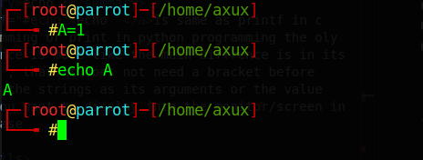
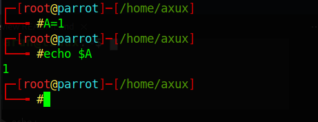
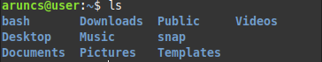
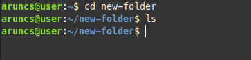
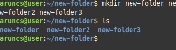
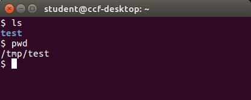
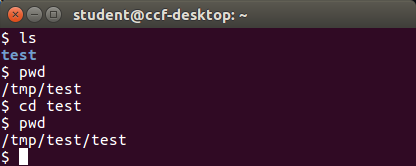

# Languages

- [Bash](#bash)
- [python](#python)


## Bash
### Basics
- [Introduction](#introduction)
- [Basic commands](#basic-commands)
- [Paths](#paths)
- 
### **Programmming**
 - [Hello World!]()
 - [Read Inputs]()
 - [Sum of Two numbers]()
 - [Multiply Two Numbers]()
 - [Increment a number]()
 - 

### Pre-requests


## Introduction
--- 
          Shell Scripting is mainly used to automate taks with the help of shell scripting language, and Bash is the most used of em' `Bash` is the default shell in allmost all linux operating systems 


_This repo will contain complete tutorial about bash_

- [Introduction](#introduction)
- [Basic commands](#basic-commands)
- [Paths](#paths)
-

### Pre-requests
- PC or Termux or ish
- a terminal
- bash or zsh installed

## Introduction
<!-- 


-->
---


_Shell Scripting is mainly used to automate taks with the help of shell scripting language and Bash is the most used of em' `Bash` is the default shell in allmost all linux operating systems_

---

Type Following on any terminal

```
$ echo $BASH_VERSION

```


this will print current version of bash you are using


<details>
<summary>echo :</summary>
<a href="#echo">echo  </a>is same as printf in c programming or print in python programming the oly diffrence is more like the main diffrence is in its syntax , that it does not need a bracket before giving the strings as its arguments or the value that you want to display into the monitor/screen in this case

</details>
<details>
<summary>$ :</summary>
 "$" is used when when calling an object 
 eg: consider the following example 

 

 in the above example we did assign a value to a newly initiated variable A , and we tried to print its value using [`echo`](#echo) but it is not printing the value of A that we initialy assigned 

 Now consider an another example

 
 In this above example we got exactly we have expected ie, using `echo` we where able to print the value of `A` that we're initialy assigned

</details>

<details>
<summary>Notes: </summary>You can get full usage of almost any command in linux usig --help option with_ _sometimes -h also works and do the same_
eg:

```
> pwd --help
```

output

```
pwd: pwd [-LP]
    Print the name of the current working directory.                                                                                                            Options:
      -L        print the value of $PWD if it names the current working directory
      -P        print the physical directory, without any symbolic links

    By default, `pwd' behaves as if `-L' were specified.
                                                                                  Exit Status:
    Returns 0 unless an invalid option is given or the current directory
    cannot be read
```
</details>

## Basic commands

| Commands |  Description           |
| :--------: | ------------------------ |
|[`mkdir`](#mkdir)| To make a directories/directory(folder)|
| [`ls`](#ls)     | List all the files in the current directry      |
| [`pwd`](#pwd)  | Print the name of the current working directory |
| [`cd`](#cd)     | change the current working directry             |
| [`mv`](#mv)| move files to directories or rename files|
|[`cp`](#cp)|copy files to directories |
| [`rm`](#rm)| To remove files/directories | 

## ***more about this below***

### ***mkdir***
  *[`mkdir`](#mkdir) (make directory)*  is used to create directory(folder) or miltiple directories (folders)

*we can create a folder called new-directory using mkdie*

```
$ mkdir new-folder

```



[`mkdir`](#mkdir)o list out folders and files the current working directory


*we can also create multiple directories using [`mkdir`](#mkdir)* 






*we can see that if we type more names after  [`mkdir`](#mkdir) it creates mutliple [`directory`](../Dictionary#directory)*

*So the basic syntax of mkdir is*

```
$ mkdir <foldername> <foldername2> ...

```
learn more about `mkdir`     [here](https://www.gnu.org/software/coreutils/mkdir)


### ***ls***

_Normaly bash program will be situated under the /bin folder where almost all the user executable programs contains you can take a look at what inside that folder by_

```
$ ls /bin
```

_so we used `ls` to list all the files_


<details>
<summary>Notes: </summary>
*we can give some arguments to the ls command which will produce diffrent outputs*
*for example "-lh" argument combined with `ls` will show you the size of that file*
</details>


> -l is used to use a long listing format

> -h is used to make it human readable 

*Learn more about  `ls`  [here](https://www.gnu.org/software/coreutils/ls) 

### ***pwd***
  *`pwd` is used to know your [current directory](../Dictionar#current-directory)*


*The /home/aruncs folder have an nother property it is yout home path* [more about this](#paths)


### ***cd***
  `cd` is used for changing working [`directries`](../Dictionary/README.md/#directory)(folder)


<details>
<summary>Notes</summary>
*To understand this simply consider if we have to delete a file which we have downloaded from internet and we dont know it's name but it is in the folder `$HOME/Downloads` we can do this in many ways azbut one of the easyest way is to go into the folder and inspect the files and delete the one that we dont need suppose we want to delete song.mp3 form download ; we first need to go to the folder specified above so inorder to go to that folder we use `cd`(change directory) command*
</details>

#### Usage

``` 
cd /path/to/the/folder

```




we can see there is a folder named test in our current working directry


Tip: We used [`ls`](#ls) command to list(to see as a list) the files



*Dont confuse with that path name, we will cover that one in
linux file system* 

*So specified the path name after cd , after that we can see that our current directory is changed to `/tmp/test/test` before it was `/tmp/test`

### **cp**

**cp** is used to copy files/folders  


#### Usage
```
cp old_name new_name 
```
which renames file named name1 to name2 

**Note:** We can use cp to copy folders as well as files 

<details><summary>Explenation: </summary>

</details>

```
$ ls

song.mp3

$ cp song.mp3 old_song.mp3 

$ ls

old_song.mp3
```

</details>


---
### **mv**
**mv** is mainly used to move or renames files the 

#### Uses

```
mv old_name new_name

```


##### Files
```
mv old_name new_name
```

**Note:** We can use `mv` to rename both folders and files


<details><summary>Explenation: </summary>

f
</details>

---
### **rm**
    `rm` is used to remove files or folders, 

#### Usage

```
rm file_name

rm folder_name


```
<details><summary>Note: </summary>Inorder to remove folders/directories you need to use `--recursive` `-r` and you can also force the deletion using `-f` `--force` argument</details>

[more details](https://gnu.org/software/coreutils/rm)

```
$ ls

song.mp3

$ rm song.mp3

$ ls

$
```


## Paths

*We can check the current Varriables that are beeing used by just typing system

```
$ set
BASH=/usr/bin/bash
BASHOPTS=checkwinsize:cmdhist:complete_fullquote:expand_aliases:extglob:extquote:force_fignore:globasciiranges:histappend:interactive_comments:progcomp:promptvars:sourcepath
BASH_ALIASES=()
BASH_ARGC=([0]="0")
BASH_ARGV=()
BASH_CMDS=()
BASH_COMPLETION_VERSINFO=([0]="2" [1]="11")
BASH_LINENO=()
BASH_REMATCH=()
BASH_SOURCE=()
BASH_VERSINFO=([0]="5" [1]="1" [2]="4" [3]="1" [4]="release" [5]="x86_64-pc-linux-gnu")
BASH_VERSION='5.1.4(1)-release'
COLORTERM=truecolor
COLUMNS=127
COMP_WORDBREAKS=$' \t\n"\'><=;|&(:'
DBUS_SESSION_BUS_ADDRESS=unix:path=/run/user/1000/bus
DESKTOP_SESSION=lightdm-xsession
DIRSTACK=()
DISPLAY=:0.0
EUID=1000
GDMSESSION=lightdm-xsession
GPG_AGENT_INFO=/run/user/1000/gnupg/S.gpg-agent:0:1
GROUPS=()
GTK_MODULES=gail:atk-bridge
GTK_OVERLAY_SCROLLING=0
HISTCONTROL=ignoreboth
HISTFILE=/home/axux/.bash_history
HISTFILESIZE=2000
HISTSIZE=1000
HOME=/home/axux
HOSTNAME=parrot
HOSTTYPE=x86_64
IFS=$' \t\n'
```

**HOME**

*home path will be always be your /home/username unless you cange it*


*Also `~` this symbol is linked to HOME variable/reference*


## Programming in Bash
An important thing to note is that you have make scrip files as  executable by using `chmod` by `chmod +x filename.sh` 

### **Hello World!**

*you can use either `echo` or `printf` to ptint a string*

```
$ echo "Hello World"
Hello World!

$ printf "Hello World!"
Hello World!
```
commands used : `echo` `printf`

###  **Reading Users Inputs**
 We use read to read Users input

read.sh
``` 
  echo "Enter your Name"
  read name
  echo "Hi $name"
```


```
bash read.sh

```


<details><summary>Explenation: </summary>

`#!/bin/bash` is called the shebang which tells the computer to run the script using the bash shell.
`echo` command is used to print
`read` command is used to get user input
</details>

### Arithmatic Operations

1. Sum of 2 Numbers

```

echo $((num1 + num2))

```
*You can either specify num1 and num2 or get it from user on any other programm*

ie: 
```
$ num1=10
$ num2=20
$ echo $((num1 + num2))
30

```


```
#!/bin/bash
echo "Enter the first Number"
read number1
echo "Enter the second Number"
read number2
echo "sum = " $((number1 + number2))

```

<!-------------------------------->

2. Multiplication of Two numbers 


### Increment a number

consider we initialize `num` as 0 the we use `((num+=1))``

```
$ num=0
$ echo $n
0
$ ((num+=1))
$echo $n 
1
$ ((numbers+=1))
$ echo $n
2
```


## python

- [ Creating a simple server](#creating-a-simple-server)

- [Downloading Youtube videos](#youtube-dl)
###  Creating a simple server

 if you have python 2.x

 ``` 
 python -m SimpleHTTPServer

 ```

 if you have python 3.x

 ```
 python3 -m http.server
 ```

### Downloading Youtube videos

#### Requires 
`youtube-dl`
#### Installition
```
pip3 install youtube-dl
```

#### Usage 

##### video

```

youtube-dl <link> 

```
 **best**
```
youtube-dl -f best <URL>

```

##### audio 


```
youtube-dl -x --audio-format mp3 <URL>


