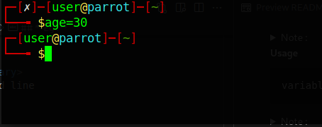
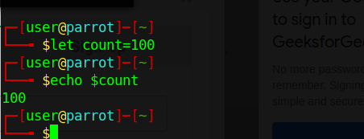
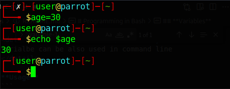
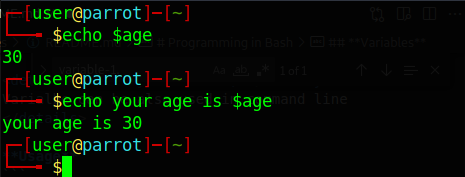
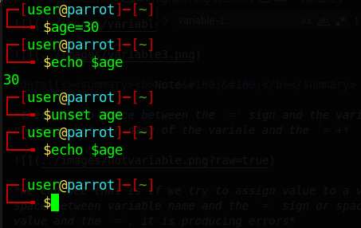
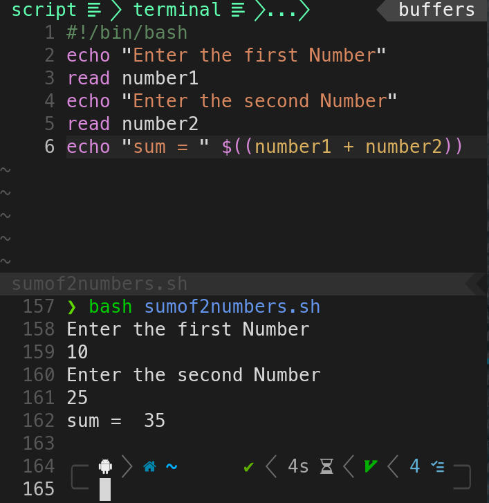

# Languages

- [Bash](#bash)
   - [Language](#bash-programming)
   - [Scripting](#shell-scripting)
- [python](#python)

**You can learn more about Linux in [here](../Pre-Requests/README.md#linux)**

## **Bash Programming**
 - [Introduction To Bash Programming]()
 - [Hello World!]()
 - [Executing a Script]()
 - [Variables](#variables)
 - [Read Inputs]()
 - [Sum of Two numbers]()
 - [Multiply Two Numbers]()
 - [Increment a number]()
 - [if else](#if-else)
 - [loops]()
  - [for]()
  - [while]()

### **Pre-requests**

- `PC` or `Termux` or `ish`
- a terminal
- bash or zsh installed


## **Introduction To Bash**
--- 
Bash is not realy a programming language rather just a shell . But this shell let us to talk to the operating system and delivers it's(operating system's) response , kind of like a midle man . You can Call bash as a `scripting language` , a `shell` what ever you like.But the thing is bash is an `interpreter` which interprets the commands and prints out the response . So the bash can interpret a specific type of scripting language and we call it `Bash` .


- Bash : 

- Shell Scripting : Shell Scripting is mainly used to automate taks with the help of shell scripting language, and Bash is the most used of em' `Bash` is the default shell in allmost all linux operating systems 


_This repo will contain complete tutorial about  bash and shell scripting_


Type Following on any terminal

```
$ echo $BASH_VERSION

```


this will print current version of bash you are using


<details>
<summary>echo :</summary>
<a href="#echo">echo  </a>is same as printf in c programming or print in python programming the oly diffrence is more like the main diffrence is in its syntax , that it does not need a bracket before giving the strings as its arguments or the value that you want to display into the monitor/screen in this case

</details>
<details>
<summary>$ :</summary>
 "$" is used when when referencing a variable
 eg: consider the following example 

 

 in the above example we did assign a value to a newly initiated variable A , and we tried to print its value using [`echo`](#echo) but it is not printing the value of A that we initialy assigned 

 Now consider an another example

 
 In this above example we got exactly we have expected ie, using `echo` we where able to print the value of `A` that we're initialy assigned

</details>


---


## **Hello World!**

*you can use either `echo` or `printf` to ptint a string*

```
$ echo "Hello World"
Hello World!

$ printf "Hello World!"
Hello World!
```


## **Executing a Script**
This is a very important section among all the other section . Becouse in order to do shell scripting you need to know how to save them , execute them .

- Let's create a Script Using the above example
*You can use any editor you want im using nano it is simple and alredy installed on almost any linux distro*


```
$ nano test_script.sh
```


- Now type the follwing

```
echo "Hello World!"

```


- Press Controll


An important thing to note is that you have make scrip files as  executable by using `chmod` by `chmod +x filename.sh` 


---


## **Variables**

- [**Seting a variable**]()
- [**unsetting a variable**]()
- [**]

  `variables` are used to store values that can be later used in that programm,

<details><summary><b>Note&#160;&#160;:</b></summary>
Varialbe can be also used in command line 
</details>

**Usage** 
- **Direct assigning**
```
variablename=value
```


- **Using `let`**
```
let variabename=value
```


*let command can not be used to assign `strings` to a variable*


- **Using Linux environment Variables**

```
export variablename=value
```


***here we just assigned the value 30 to a variable named age*** ***and this variable can be later used in programms or in command line itself***




<details><summary><b>Note&#160;&#160;</b></summary>

*there is no space between the `=` sign and the variable name and also no space between name of the variale and the `=`+*


*we can see that is if we try to assign value to a variable with a space between variable name and the `=` sign or space between variable value and the `=`, it is producing errors*

</details>


<details><summary> <b>Note&#160;&#160;</b> </summary>


**`unset`** is used to remove a variable**



</details>


**Eg :**
&#160;
---
&#160;

&#160;


##  **Reading Users Inputs**
 We use read to read Users input

read.sh
``` 
  echo "Enter your Name"
  read name
  echo "Hi $name"
```


```
bash read.sh

```


<details><summary>Explenation: </summary>

`#!/bin/bash` is called the shebang which tells the computer to run the script using the bash shell.
`echo` command is used to print
`read` command is used to get user input
</details>

## Arithmatic Operations

1. Sum of 2 Numbers

```

echo $((num1 + num2))

```
*You can either specify num1 and num2 or get it from user on any other programm*

ie: 
```
$ num1=10
$ num2=20
$ echo $((num1 + num2))
30

```


```
#!/bin/bash
echo "Enter the first Number"
read number1
echo "Enter the second Number"
read number2
echo "sum = " $((number1 + number2))

```


<!-- -->


<!-------------------------------->

2. Multiplication of Two numbers 


## Increment a number

consider we initialize `num` as 0 the we use `((num+=1))``

```
$ num=0
$ echo $n
0
$ ((num+=1))
$echo $n 
1
$ ((numbers+=1))
$ echo $n
2
```
## if else

- [if]()
- [if else]()

### if

**Usage :**
```
if condition 
then

  expression
fi
```
<details><summary>Eg :</summary>


</details>


### if else 

**Usage :**


```
if condition
then
  expression
else  
  expression
fi
```

---


- [Executing A Script](#executing-a-script)


<!-- 


## python

- [ Creating a simple server](#creating-a-simple-server)

- [Downloading Youtube videos](#youtube-dl)
###  Creating a simple server

 if you have python 2.x

 ``` 
 python -m SimpleHTTPServer

 ```

 if you have python 3.x

 ```
 python3 -m http.server
 ```

### Downloading Youtube videos

#### Requires 
`youtube-dl`
#### Installition
```
pip3 install youtube-dl
```

#### Usage 

##### video

```

youtube-dl <link> 

```
 **best**
```
youtube-dl -f best <URL>

```

##### audio 


```
youtube-dl -x --audio-format mp3 <URL>


-->
